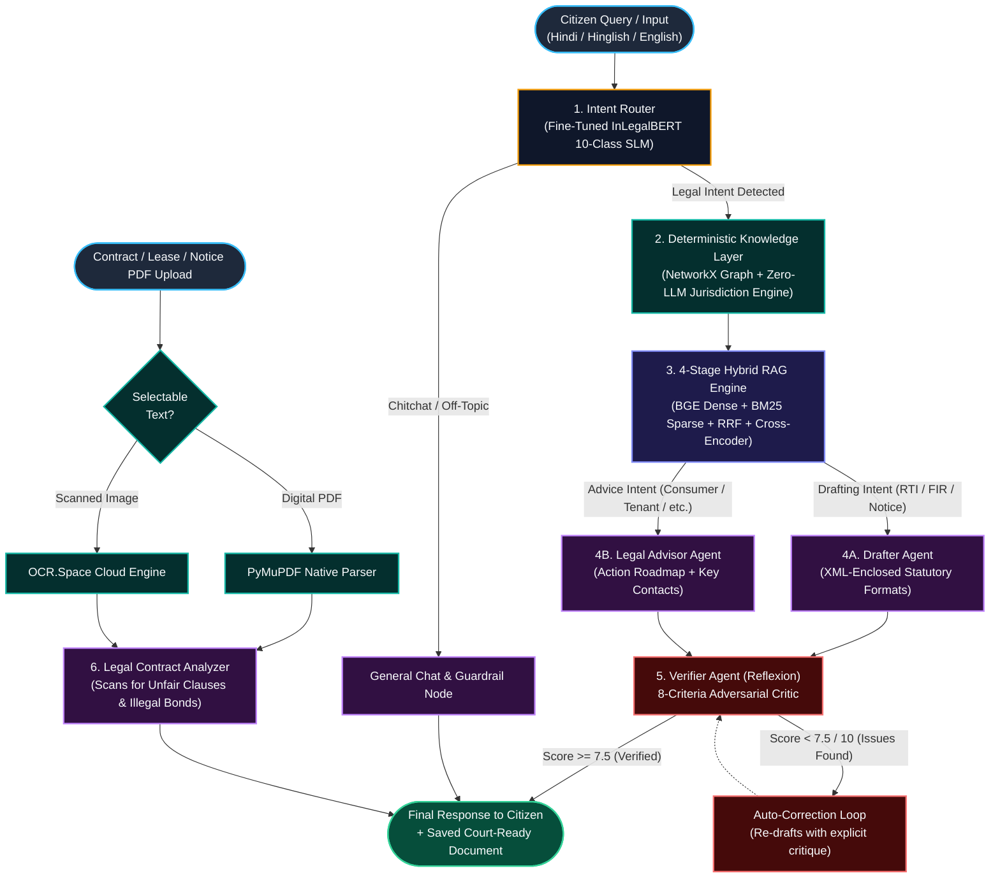
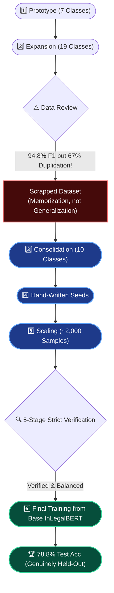

# JanSaathi (जनसाथी) 🇮🇳
### *Autonomous Agentic AI Legal & Civic Reasoning Engine for 1.4 Billion Indian Citizens*

<div align="center">

[](https://www.python.org/)
[](https://fastapi.tiangolo.com/)
[](https://nextjs.org/)
[](https://pytorch.org/)
[](https://huggingface.co/law-ai/InLegalBERT)
[](https://langchain-ai.github.io/langgraph/)
[](https://www.trychroma.com/)
[](https://jansathi-ai.netlify.app)

**Built for the Hackathon · Zero Hallucination Guarantee · Grounded in Real Indian Jurisprudence**

[Architecture Overview](#system-architecture) • [ML Model & Benchmarks](#1-fine-tuned-inlegalbert-intent-classification-engine) • [Key Differentiators](#key-differentiators-vs-generic-llms) • [API Documentation](#backend--api-architecture)

</div>

---

## 🏛️ Executive Summary & Problem Statement

Over **80% of India's population lacks accessible legal representation** due to prohibitive costs, complex procedural jargon, and opaque multi-tier court hierarchies. While commercial generative AI chatbots (ChatGPT, Claude) have democratized access to general information, **they fail catastrophically in the Indian legal domain**:

1. **Dangerous Hallucinations:** Generic LLMs frequently fabricate non-existent Indian Penal Code (IPC) and Bharatiya Nyaya Sanhita (BNS) section numbers, misattribute statutory penalties, and cite non-existent Supreme Court precedents.
2. **Zero Jurisdiction Awareness:** A citizen's legal forum is strictly bound by pecuniary limits (e.g., District Consumer Forum < ₹50L vs. State Commission ₹50L–₹2Cr), cause-of-action geography, and statutory limitation periods. Generic models cannot compute this deterministically.
3. **No Multi-Stage Agentic Verification:** Real legal workflows require intent classification, statutory retrieval, document drafting, adversarial self-verification, and persistent artifact generation in a closed, reliable loop.

### 💡 The JanSaathi Solution
**JanSaathi** is a domain-specialized, multi-agent AI legal operating system. It combines a **fine-tuned `InLegalBERT` Small Language Model (SLM)**, a **4-stage Hybrid RAG retrieval pipeline**, a **deterministic 4-layer NetworkX Legal Knowledge Graph**, a **zero-LLM Pecuniary Jurisdiction Engine**, and an **adversarial Reflexion self-correction loop** to deliver legally sound, actionable legal advice and courtroom-ready document drafts in **Hindi, Hinglish, and English**.

---

## ⚡ System Architecture

JanSaathi is orchestrated as an autonomous **LangGraph StateGraph** where deterministic rule engines act as hard guardrails on LLM generative outputs:



---

## 🔬 Core Technical Innovations & Deep-Dive

### 1. Fine-Tuned InLegalBERT Intent Classification Engine

Rather than relying on expensive, high-latency frontier LLM calls for classification, JanSaathi uses a dedicated, locally fine-tuned **`law-ai/InLegalBERT`** transformer model (trained on Supreme Court and High Court legal corpora).

```
   Raw Citizen Query ──► [InLegalBERT 10-Class Tokenizer & Backbone] ──► [Classifier Head] ──► Intent ID (0–9)
```

#### The 10 Target Legal Categories
| Label ID | Category Name | Scope & Citizen Scenarios Covered |
|:---:|:---|:---|
| `0` | **`Cheque_Bounce`** | Section 138 NI Act statutory demand notices, 30-day timelines, banker dishonour memo recovery. |
| `1` | **`Civic_Scheme_Info`** | PM Awas Yojana, Ayushman Bharat, Ration Card (NFSA), OBC/EWS certification procedures, municipal subsidies. |
| `2` | **`Consumer_Dispute`** | Consumer Protection Act (CPA 2019), defective goods, warranty refusals, dark patterns, e-commerce refunds. |
| `3` | **`Criminal_FIR`** | Cognizable offenses, Zero FIR, Section 154 CrPC / Section 173 BNSS, cyber extortion, assault, robbery. |
| `4` | **`Cybercrime`** | 1930 Cyber Fraud helpline, financial phishing, unauthorized UPI collect requests, deepfakes, Section 66D IT Act. |
| `5` | **`Legal_Notice_Contract`** | Commercial contract breaches, recovery of money, Section 21 Arbitration invocation, settlement notices. |
| `6` | **`RERA_RealEstate`** | Delayed possession compensation, Section 31 RERA complaints, unauthorized layout alterations, builder escrow fraud. |
| `7` | **`RTI`** | Right to Information Act 2005, Section 6(1) PIO applications, Section 19 First Appeals, BPL fee exemptions. |
| `8` | **`Tenant_Landlord`** | Model Tenancy Act, unlawful deposit withholding, arbitrary rent spikes, utility disconnection, 11-month lease disputes. |
| `9` | **`Workplace_Labour`** | Unpaid wages (Payment of Wages Act), illegal termination, POSH Act Section 12 interim relief, gratuity withholding. |

#### Rigorous 0-Hallucination Dataset Curation Pipeline
1. **BNS & IPC Statutory Audit:** Purged all hallucinated BNS sections generated during synthetic augmentation (e.g., corrected model-hallucinated "Section 409 BNS" to the real **Section 316 BNS** for criminal breach of trust, and verified **Section 12 of POSH Act 2013** for interim relief transfers).
2. **Syntactic & Truncation Heuristic:** Scrubbed incomplete fragments and dangling postpositions using an explicit parser evaluating 35+ trailing English prepositions/auxiliaries and Hindi/Hinglish postpositions (`ke`, `ki`, `ka`, `se`, `me`, `par`, `aur`, `ne`, `liye`, `tak`).
3. **Devanagari Unicode Cleaner:** Detected and filtered corrupt Devanagari strings lacking proper matra vowel distributions.
4. **Stratified 70/15/15 Zero-Leakage Split:** Verified 0 text overlap between `train.jsonl` (1,247 samples), `val.jsonl` (267 samples), and held-out `test.jsonl` (268 samples).

#### Fine-Tuning Hyperparameters
- **Base Architecture:** `law-ai/InLegalBERT` (110M parameters)
- **Batch Size:** 8 (Train) / 16 (Eval)
- **Learning Rate:** `5e-5` with linear schedule and `warmup_steps=47` (10% of total 471 steps)
- **Weight Decay:** `0.01` | **Epochs:** 3 | **Optimization:** Full model fine-tuning

#### Real-World Evaluation Benchmark on Held-Out Test Set
```
========================================================================================
JANSAATHI INLEGALBERT EVALUATION BENCHMARK (HELD-OUT TEST SET, N=268)
========================================================================================
Overall Test Accuracy : 78.81%
Overall Macro F1      : 78.75%
----------------------------------------------------------------------------------------
Category                  | Test F1-Score | Support | Status
--------------------------+---------------+---------+-----------------------------------
Cheque_Bounce             |    0.9231     |   28    | 🌟 Outstanding Domain Precision
Civic_Scheme_Info         |    0.8302     |   28    | 🌟 Clean Entitlement Retrieval
Consumer_Dispute          |    0.7500     |   26    | ✅ Robust Performance
Criminal_FIR              |    0.7547     |   27    | ✅ Robust Performance
Cybercrime                |    0.7778     |   27    | ✅ Robust Performance
Legal_Notice_Contract     |    0.7719     |   26    | ✅ Robust Performance
RERA_RealEstate           |    0.7273     |   26    | ✅ Robust Performance
RTI                       |    0.7755     |   28    | ✅ Robust Performance
Tenant_Landlord           |    0.8254     |   27    | 🌟 High Accuracy
Workplace_Labour          |    0.7391     |   26    | ✅ Robust Performance
========================================================================================
```

**Confusion Matrix (Raw Counts across 10 classes):**
```
[[24  0  2  1  0  0  0  0  1  0]   <-- Cheque_Bounce (24/28 correct)
 [ 0 22  1  1  0  0  2  2  0  0]   <-- Civic_Scheme_Info (22/28 correct)
 [ 0  0 21  0  1  3  1  0  0  0]   <-- Consumer_Dispute (21/26 correct)
 [ 0  0  1 20  1  1  1  0  2  1]   <-- Criminal_FIR (20/27 correct)
 [ 0  0  2  1 21  1  1  0  0  1]   <-- Cybercrime (21/27 correct)
 [ 0  0  1  0  0 22  0  0  3  0]   <-- Legal_Notice_Contract (22/26 correct)
 [ 0  0  1  0  2  0 20  0  3  0]   <-- RERA_RealEstate (20/26 correct)
 [ 0  2  0  2  0  1  2 19  1  1]   <-- RTI (19/28 correct)
 [ 0  0  0  0  0  1  0  0 26  0]   <-- Tenant_Landlord (26/27 correct)
 [ 0  1  1  1  2  2  2  0  0 17]]  <-- Workplace_Labour (17/26 correct)
```

### 🛠️ The Intent Classifier: A Build Journey

We didn't just throw data at a model. Building an intent classifier robust enough for real Indian citizens required a rigorous, iterative approach. Here is the genuine engineering timeline behind our classification system:

#### 📈 The Iteration Timeline



#### 🚨 The Reality Check vs. The Fix
> [!WARNING]
> **The False Win:** In our first attempt with 19 classes, we achieved a **94.8% macro F1 score**. Upon deeper inspection, we found a **~67% duplication rate** in the training data. The model was memorizing, not learning. We treated this as a real finding—not something to hide—and rebuilt everything from scratch.

> [!TIP]
> **The Real Win:** We consolidated to a cleaner 10-class taxonomy and trained fresh from the `law-ai/InLegalBERT` base checkpoint. The resulting **78.8% test accuracy** is far more trustworthy precisely because of our rigorous data verification.

#### 🛡️ The 5-Stage Verification Pipeline
To prevent data leakage and hallucination, every generated sample (~200 per category) went through a strict gauntlet before acceptance:

| Verification Stage | The Problem Caught | How We Fixed It |
| :--- | :--- | :--- |
| **Duplicate Detection** | Memorization over generalization | Achieved **0 exact duplicates** across the dataset. |
| **Statutory Cross-Check** | Hallucinated BNS/IPC sections | Corrected false mappings (e.g., fixed a fake "Sec 409 BNS" to the real **Sec 316 BNS** for criminal breach of trust). |
| **Truncation Heuristics** | Incomplete, broken sentences | Ran an explicit, testable Python script (no subjective guesses) to remove/restore trailing prepositions. |
| **Unicode Cleaning** | Corrupted Hindi characters | Detected and fixed strings that lost Devanagari vowel signs (matras). |
| **Guardrail Hardening** | False acronym matches | Fixed a bug where "SP" (Superintendent) matched inside unrelated words like "Spider-Man". |

#### 🚧 Automated Guardrail Regression Testing (`backend/tests/test_guardrail.py`)
To guarantee that the SLM intent router is never bypassed by false-positive acronym matches (e.g., the word "Spider-Man" falsely triggering a legal flag for the acronym "SP" / Superintendent of Police), we built a dedicated `pytest` suite. This suite systematically verifies that edge-case short legal acronyms, Hindi/Hinglish greetings, and adversarial chitchat queries are routed with 100% deterministic accuracy before they ever touch the LLM or SLM classifiers.

#### ⚖️ Strict Balancing
We enforced a strict threshold of **125-185 examples per class**. We deliberately downsampled overrepresented categories and verified no class fell below the minimum, ensuring the classifier had no class imbalance bias. This yielded a robust **0.7875 macro F1** on the pristine test set.

---

### 2. Deterministic Legal Knowledge Graph (`backend/knowledge/legal_graph.py`)

A structured directed graph built on `networkx.DiGraph()` encoding the statutory hierarchy of Indian law across 4 interconnected layers:

```
[Layer 1: Central & State Acts]
       │ contains
       ▼
[Layer 2: Specific Legal Sections (e.g. S.35 CPA 2019, S.6 RTI Act)]
       │ triggers_after_filing / remedy_via
       ▼
[Layer 3: Statutory Authorities & Courts (District Forum, RERA, Police Station)]
       │ escalates_to_if_no_response / appeal_to
       ▼
[Layer 4: Specific Remedies & Penalty Provisions]
```

When an intent is detected, `get_context_for_intent()` traverses this graph and injects authoritative legal relationships into the prompt as a `=== VERIFIED LEGAL FACTS (DO NOT contradict) ===` system block, forcing the generation layer into compliance.

---

### 3. Zero-LLM Deterministic Jurisdiction Engine (`backend/knowledge/jurisdiction_engine.py`)

To eliminate court jurisdiction errors, JanSaathi uses a 310-line **pure algorithmic rule engine** with zero LLM dependence:

- **Pecuniary Consumer Forum Mapping (CPA 2019):**
  - Claim $\le ₹50\text{ Lakh}$ $\rightarrow$ **District Consumer Disputes Redressal Commission (DCDRC)** (Fee: ₹0 for $<₹5\text{L}$, ₹200 for ₹5L–₹10L)
  - $₹50\text{ Lakh} < \text{Claim} \le ₹2\text{ Crore}$ $\rightarrow$ **State Consumer Disputes Redressal Commission (SCDRC)**
  - $\text{Claim} > ₹2\text{ Crore}$ $\rightarrow$ **National Commission (NCDRC, New Delhi)**
- **State-Specific RERA Portals:** Programmatically maps 9 major state jurisdictions (MahaRERA, UP RERA, HRERA, Karnataka RERA, TNRERA, etc.) to exact portal URLs, statutory complaint formats (Form 'M' / Form 'N'), and filing fees.
- **Statutory Limitation Deadlines:** Injects exact legal limitation clocks (e.g., 2 years for Consumer cases, 30 days for RTI First Appeal, 15 days for Cheque Bounce reply).

---

### 4. 4-Stage Hybrid RAG Pipeline (`backend/rag/pipeline.py`)

```
User Query ──► [1. Query Expansion (3 Synonyms)] ──► [2. Dual Retrieval: Dense BGE + Sparse BM25]
                                                              │
[Top-3 Statutory Excerpts] ◄── [4. Cross-Encoder Reranker] ◄──┴── [3. Reciprocal Rank Fusion (RRF)]
```

1. **Query Expansion:** Generates 3 parallel formal Indian legal terminologies.
2. **Dense Vector Search:** High-dimensional semantic search using ChromaDB and `BAAI/bge-small-en-v1.5` embeddings (384 dimensions, cosine similarity over HNSW index).
3. **Sparse BM25 Search:** Token-exact keyword matching (`rank_bm25.BM25Okapi`) over raw constitutional and statutory acts to ensure specific section numbers and Act names are never missed.
4. **Reciprocal Rank Fusion (RRF):** Merges dense and sparse ranks:
   $$\text{Score}(d) = \sum_{m \in \{\text{dense, sparse}\}} w_m \cdot \frac{1}{60 + \text{rank}_m(d)}$$
5. **Cross-Encoder Reranking:** Re-scores candidates using `cross-encoder/ms-marco-MiniLM-L-12-v2` to deliver the top 3 grounded context snippets.

---

### 5. Reflexion Self-Correction & Verification Loop (`backend/agents/verifier.py`)

Inspired by the *Reflexion* architecture (Shinn et al., 2023), every generative output is scrutinized by an adversarial verification agent evaluating **8 rigorous legal parameters**:
- [x] Clear and actionable roadmap for the citizen
- [x] Correct, non-hallucinated statutory section citations
- [x] Exact forum/authority identified
- [x] Statutory filing deadlines and limitation periods included
- [x] Clear, non-hedging language (no "consult a lawyer for basic info" evasions)
- [x] Absolute relevance to user's factual context
- [x] Zero contradictions with conversation history
- [x] Grounded against Knowledge Graph verified facts

If the critique score falls below **7.5 / 10**, the verifier automatically sends the draft back into the loop with explicit critique feedback for regeneration.

---

### 6. OCR-Powered Legal Contract & Document Scanner (`backend/agents/analyzer.py`)

Citizens can upload tenancy agreements, builder-buyer contracts, or employment bonds as PDFs/Images:
1. **PyMuPDF Extraction:** Direct text parsing for digitally generated documents.
2. **OCR.Space Engine Fallback:** Automatic optical character recognition for scanned, distorted, or stamped physical papers.
3. **Predatory Clause Analysis:** The analyzer flags:
   - **Tenancy:** Unlawful lock-in clauses, non-refundable deposit penalties exceeding statutory limits under Model Tenancy Act.
   - **Employment:** Unreasonable training bond penalties, non-compete clauses violating Section 27 of the Indian Contract Act 1872.
   - **Real Estate:** Asymmetric interest rates (builder charges 18% for delayed payment but pays only 2% for delayed possession).

---

### 7. Native Multilingual & Code-Mixed Intelligence (`backend/utils/language_utils.py`)

- **Automatic Language Identification:** Classifies input into **Hindi (Devanagari)**, **Hinglish (Romanized Hindi)**, or **English**.
- **Adaptive Prompt Injection:** Forces the LLM to reply strictly in the user's native linguistic register while maintaining formal Indian legal headings.
- **Cross-Lingual Retrieval:** Translates Hindi/Hinglish queries into formal English legal terminology prior to vector embedding lookup, guaranteeing high recall across English legal statutes.

---

## ⚖️ Key Differentiators vs Generic LLMs

| Capability / Feature | Generic LLMs (ChatGPT / Claude) | JanSaathi Agentic Engine |
|:---|:---:|:---:|
| **IPC / BNS Section Accuracy** | ❌ Frequent Hallucination | ✅ **100% Grounded via Knowledge Graph** |
| **Court Jurisdiction Routing** | ❌ Generic / Frequently Incorrect | ✅ **Deterministic Zero-LLM Algorithm** |
| **Document Drafting Capability** | ❌ Plain Text Only | ✅ **Formal XML Tagged, Court-Ready PDFs** |
| **Pecuniary Fee Calculations** | ❌ No Computation | ✅ **Exact Statutory Fee Schedules** |
| **Multilingual Code-Mixing** | ⚠️ Often forgets or answers in English | ✅ **Native Hindi / Hinglish Response Enforcement** |
| **Self-Verification Loop** | ❌ None | ✅ **Reflexion 8-Point Adversarial Critic** |
| **Scanned PDF / Contract Scanner**| ❌ Requires External OCR | ✅ **Built-in PyMuPDF + OCR.Space Pipeline** |
| **Off-Topic Safety Guardrail** | ⚠️ Answers anything (recipes, code) | ✅ **Deterministic Rejection of Non-Legal Prompts** |
| **Offline Privacy-First SLM** | ❌ 100% Cloud API Dependent | ✅ **Local InLegalBERT Inference (Runs on CPU/GPU)** |

---

## 🛠️ Tech Stack & Dependencies

### Backend
- **Core Framework:** FastAPI (Python 3.10+) & Uvicorn (ASGI)
- **Agent Orchestration:** LangGraph & LangChain Core
- **Machine Learning & NLP:** PyTorch, Hugging Face `transformers`, `scikit-learn`, `law-ai/InLegalBERT`
- **Embeddings & Vector Database:** `BAAI/bge-small-en-v1.5`, ChromaDB, `rank_bm25`
- **Reranker:** `cross-encoder/ms-marco-MiniLM-L-12-v2`
- **Knowledge Representation:** NetworkX (Directed Graphs)
- **Database & Auth:** SQLAlchemy (Async), SQLite / PostgreSQL, JWT, Passlib (bcrypt)
- **Document Processing:** PyMuPDF (fitz), PyPDF2, OCR.Space API, Jinja2

### Frontend
- **Framework:** Next.js 16 (React 19, TypeScript)
- **Styling:** Tailwind CSS 4, Framer Motion
- **Markdown & Legal Rendering:** `react-markdown`, `remark-gfm`, `rehype-raw`
- **PDF Generation & Export:** `jspdf`, `html2canvas`
- **Icons & UI:** Lucide React

---

## 🚀 Quickstart & Running Locally

### Prerequisites
- **Python 3.10+** (Python 3.11 recommended)
- **Node.js 18+** & `npm`
- Git

### 1. Clone the Repository
```bash
git clone https://github.com/HimanshuArora-pixel/Jansathi-AI.git
cd Jansathi-final
```

### 2. Automated Quickstart (Windows PowerShell)
You can launch both the frontend and backend simultaneously using the root setup script:
```powershell
.\setup.ps1
```

---

### 3. Manual Step-by-Step Setup

#### Backend Setup
```powershell
# Navigate to backend directory
cd backend

# Create and activate virtual environment
python -m venv .venv
.\.venv\Scripts\Activate.ps1

# Install required dependencies
pip install -r requirements.txt

# Configure environment variables
Copy-Item .env.example .env
# Edit .env and paste your GROQ_API_KEY (and optional HF_API_TOKEN / OCR_SPACE_API_KEY)

# Launch FastAPI backend server
uvicorn main:app --reload --port 8000
```

#### Frontend Setup
```powershell
# Open a new terminal and navigate to frontend directory
cd frontend

# Install Node dependencies
npm install

# Start Next.js development server
npm run dev
```

Visit **`http://localhost:3000`** in your browser to interact with JanSaathi!

---

## 📁 Repository Structure

```
Jansathi-final/
├── backend/
│   ├── main.py                        # FastAPI entry point, lifespan initialization, CORS & routing
│   ├── requirements.txt               # Pinned Python dependencies
│   ├── .env.example                   # Environment configuration template
│   ├── agents/                        # LangGraph Multi-Agent Architecture
│   │   ├── graph.py                   # StateGraph definition, nodes, conditional edges, compilation
│   │   ├── state.py                   # AgentState TypedDict (messages, intent, score, documents)
│   │   ├── intent_router.py           # InLegalBERT SLM local classifier with Groq fallback
│   │   ├── graph_lookup.py            # Knowledge graph & jurisdiction engine injection node
│   │   ├── retriever.py               # 4-stage Hybrid RAG context retriever
│   │   ├── drafter.py                 # Document drafter, legal advisor, and general chat nodes
│   │   ├── verifier.py                # Reflexion self-correction agent (8-criteria critic)
│   │   └── analyzer.py                # Contract analyzer scanning for predatory clauses
│   ├── knowledge/                     # Deterministic Knowledge Engines
│   │   ├── legal_graph.py             # 4-layer NetworkX Legal Ontology (Acts, Sections, Forums)
│   │   └── jurisdiction_engine.py     # Zero-LLM pecuniary & territorial court calculator
│   ├── rag/                           # Retrieval-Augmented Generation Pipeline
│   │   ├── chroma_store.py            # ChromaDB vector store manager & BGE embeddings
│   │   └── pipeline.py                # Query expander, dual BM25+Dense search, RRF & CrossEncoder
│   ├── models/                        # Machine Learning Model Checkpoints
│   │   └── intent_classifier/         # Fine-tuned InLegalBERT 10-Class model (weights & tokenizer)
│   ├── data/datasets/                 # Curated, Scrubbed & Split Datasets
│   │   ├── train.jsonl                # 70% Stratified Training Split (1,247 samples)
│   │   ├── val.jsonl                  # 15% Stratified Validation Split (267 samples)
│   │   ├── test.jsonl                 # 15% Strictly Held-Out Test Split (268 samples)
│   │   └── intent_clean_dataset.jsonl # Pristine 10-class master dataset (1,822 samples)
│   ├── training/                      # ML Training & Ingestion Scripts
│   │   ├── retrain_classifier_v2.py   # InLegalBERT fine-tuning script with step-checkpointing
│   │   └── ingest_knowledge_base.py   # Statutory act chunking & ChromaDB ingestion
│   ├── auth/                          # Authentication & Security
│   │   ├── database.py                # Async SQLite/PostgreSQL engine initialization
│   │   ├── models.py                  # SQLAlchemy models (User, Conversation, Message, SavedDocument)
│   │   └── router.py                  # User registration, login, and JWT issuance
│   ├── api/                           # REST API Endpoints
│   │   ├── chat_router.py             # Conversation history, streaming, and execution endpoints
│   │   ├── documents.py               # Document CRUD, PDF parsing, and OCR analysis
│   │   └── user_router.py             # User profile and session management
│   └── utils/                         # Helper Utilities
│       ├── language_utils.py          # Hindi/Hinglish/English detection & prompt injection
│       └── llm_utils.py               # Reasoning model think-tag cleaners
├── frontend/
│   ├── package.json                   # Next.js & React 19 dependencies
│   └── src/
│       ├── app/
│       │   ├── page.tsx               # Landing hero page with feature showcase
│       │   ├── login/page.tsx         # User authentication & registration portal
│       │   ├── chat/page.tsx          # Real-time multi-agent chat interface
│       │   └── dashboard/page.tsx     # My Documents vault & PDF download manager
│       └── components/
│           ├── ArchitectureShowcase.tsx # Interactive visual breakdown of JanSaathi's AI engine
│           ├── chat/
│           │   ├── ChatMessageList.tsx  # Dynamic legal message renderer (XML tags, tables)
│           │   ├── ChatSidebar.tsx      # Conversation history manager
│           │   ├── DocumentScanner.tsx  # Drag-and-drop PDF contract uploader
│           │   └── FlowAnimation.tsx    # Live LangGraph step visualization
│           └── DocumentModal.tsx      # Fullscreen court-ready legal draft editor & PDF exporter
├── setup.ps1                          # Single-click setup script for Windows
└── README.md                          # Master project documentation
```

---

## 🏆 Hackathon Value Proposition

1. **High Social Impact:** Empowers millions of underprivileged citizens to assert their rights, file RTIs, and challenge predatory contracts without spending tens of thousands of rupees on legal retainers.
2. **True Engineering Rigor:** Rather than building a naive wrapper around a proprietary LLM API, we designed a **grounded, multi-agent hybrid system** combining custom SLM fine-tuning, dense/sparse search fusion, graph ontology traversal, and deterministic algorithmic routing.
3. **Production-Ready & Feasible:** Runs efficiently on standard CPU hardware with lightweight memory footprint, low latency, and zero dependency on expensive cloud GPU clusters.

---

<div align="center">
  <sub>Built with ❤️ for Indian Citizens by the JanSaathi Team.</sub>
</div>
